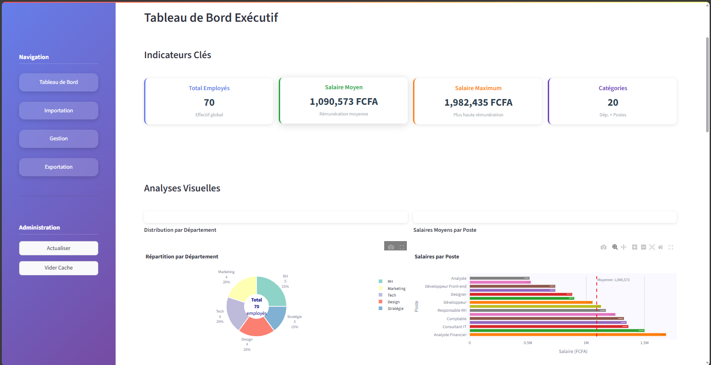
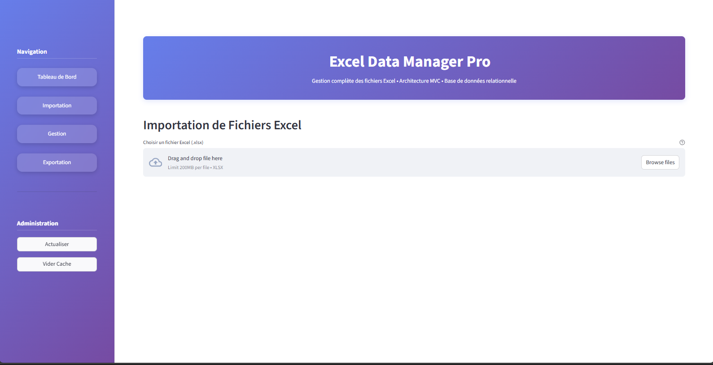
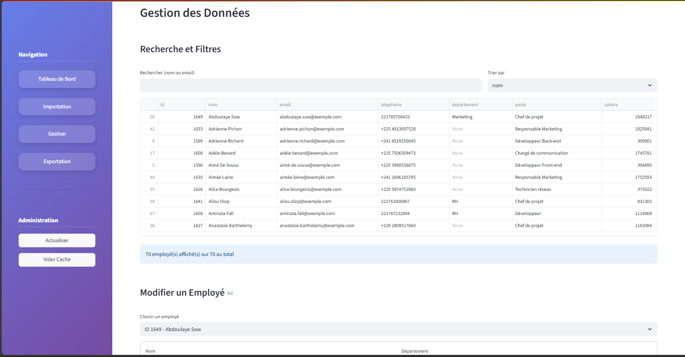

# Excel Data Manager Pro 📊

## 🎯 Présentation du Projet

**Excel Data Manager Pro** est une application web professionnelle développée pour le **Hackathon Codon 2025** qui transforme la gestion des fichiers Excel en un système complet de base de données avec interface moderne et visualisations interactives.

### 🏆 Objectif Hackathon
Créer une solution complète de gestion de données Excel avec :
- Importation de fichiers .xlsx
- Affichage structuré des données
- Modification et mise à jour dans une base de données relationnelle
- Export des résultats en format Excel

---

## 📸 Aperçu de l'Application

### 🎯 **Dashboard Exécutif**

*Interface principale avec métriques temps réel et visualisations interactives - 70 employés, salaire moyen de 1,090,573 FCFA*

### 📥 **Import Excel Intelligent** 

*Glisser-déposer de fichiers Excel avec validation automatique et détection de format*

### ✏️ **Gestion des Données**

*Recherche, filtrage et modification d'employés avec interface intuitive - 70 employés affichés*

### 📤 **Export Professionnel**

*Génération et téléchargement de fichiers Excel avec aperçu des données - 70 employés prêts à exporter*

---

## ✨ Fonctionnalités Principales

### 📥 **Import Excel Intelligent**
- Support automatique des formats `.xlsx`
- Normalisation intelligente des colonnes
- Validation et nettoyage des données
- Gestion d'erreurs complète

### 🗄️ **Base de Données Intégrée**
- SQLite embarqué (aucune configuration)
- Stockage persistant des données
- Requêtes SQL optimisées
- Sauvegarde automatique

### 📊 **Dashboard Analytics**
- **6 types de visualisations** Plotly interactives
- **Métriques en temps réel** (employés, salaires, départements)
- **Analyses adaptatives** selon les données disponibles
- **Interface responsive** avec design glassmorphism

### ✏️ **Gestion des Données**
- Modification en ligne des employés existants
- Suppression d'employés
- Recherche et filtrage avancés
- Validation en temps réel

### 📤 **Export Professionnel**
- Génération de fichiers Excel formatés
- Téléchargement direct via l'interface
- Conservation de la structure originale

---

## 🛠️ Technologies Utilisées

| Catégorie | Technologies |
|-----------|-------------|
| **Frontend** | Streamlit, CSS3, HTML5 |
| **Backend** | Python 3.11+ |
| **Base de données** | SQLite3 |
| **Visualisations** | Plotly Express & Graph Objects |
| **Processing** | Pandas, OpenPyXL |
| **Architecture** | MVC (Model-View-Controller) |

---

## 📋 Prérequis

- **Python 3.8+** (Recommandé : 3.11+)
- **pip** package manager
- **Navigateur web moderne** (Chrome, Firefox, Edge)

---

## 🚀 Installation & Lancement

### 1. **Cloner le Projet**
```bash
git clone [votre-repository]
cd excel_data_manager
```

### 2. **Créer un Environnement Virtuel** (Recommandé)
```bash
# Windows
python -m venv venv
venv\Scripts\activate

# Linux/Mac
python3 -m venv venv
source venv/bin/activate
```

### 3. **Installer les Dépendances**
```bash
pip install -r requirements.txt
```

### 4. **Lancer l'Application**
```bash
streamlit run main.py
```

### 5. **Accéder à l'Interface**
Ouvrir votre navigateur à : **http://localhost:8501**

---

## 📁 Architecture du Projet

```
📂 excel_data_manager/
├── 📄 main.py                          # 🚀 Application principale Streamlit
├── 📄 employees.db                     # 💾 Base de données SQLite (auto-créée)
├── 📄 requirements.txt                 # 📦 Dépendances Python
├── 📄 README.md                        # 📚 Documentation (ce fichier)
├── 📄 .gitignore                       # 🚫 Configuration Git
│
├── 📂 assets/                          # 🎨 Ressources statiques
│   └── 📄 styles.css                   # CSS glassmorphism & responsive
│
├── 📂 components/                      # 🎯 Composants UI (View - MVC)
│   ├── 📄 __init__.py                  # Package Python
│   └── 📄 ui_components.py             # Composants Streamlit réutilisables
│
├── 📂 controllers/                     # ⚙️ Logique métier (Controller - MVC)
│   ├── 📄 __init__.py                  # Package Python
│   └── 📄 excel_controller.py          # Traitement Excel & logique applicative
│
├── 📂 models/                          # 🗄️ Modèles de données (Model - MVC)
│   ├── 📄 __init__.py                  # Package Python
│   └── 📄 database.py                  # Gestion SQLite & ORM
│
└── 📂 venv/                            # 🐍 Environnement virtuel Python
    ├── 📂 Lib/                         # Librairies installées
    ├── 📂 Scripts/                     # Exécutables Python
    └── 📄 pyvenv.cfg                   # Configuration environnement
```

### 🏗️ **Architecture MVC**
- **Model** (`models/`) : Gestion des données et base SQLite
- **View** (`components/` + `main.py`) : Interface utilisateur Streamlit
- **Controller** (`controllers/`) : Logique métier et traitement

---

## 💡 Guide d'Utilisation

### 📥 **1. Importer des Données Excel**
1. Cliquer sur l'onglet **"Importation"**
2. Glisser-déposer ou sélectionner votre fichier `.xlsx`
3. L'application détecte automatiquement le format
4. Les données sont normalisées et importées en base

**Formats supportés :**
- Format standard : `Nom`, `Email`, `Salaire`, `Téléphone`, `Département`
- Format alternatif : `Nom`, `Email`, `Salaire`, `Phone`, `Poste`

### 📊 **2. Visualiser les Données**
- **Dashboard principal** avec métriques temps réel
- **6 graphiques interactifs** :
  - Répartition par département/poste (Donut charts)
  - Salaires moyens (Barres horizontales)
  - Distribution salariale (Histogramme)
  - Tendances (Graphique linéaire)
  - Analyse par effectifs (Barres verticales)
  - Nuage de points (Scatter plot)

### ✏️ **3. Gérer les Données**
1. Onglet **"Gestion"** pour modifier les données existantes
2. **Recherche et filtrage** des employés
3. **Modification en ligne** avec validation
4. **Suppression** d'employés avec confirmation
5. Sauvegarde automatique en base

### 📤 **4. Exporter les Résultats**
1. Onglet **"Exportation"**
2. Génération automatique du fichier Excel
3. Téléchargement direct via l'interface

---

## 🗄️ Structure de la Base de Données

```sql
CREATE TABLE employees (
    id INTEGER PRIMARY KEY AUTOINCREMENT,
    nom TEXT NOT NULL,
    email TEXT,
    telephone TEXT,
    departement TEXT,
    poste TEXT,
    salaire REAL,
    date_creation TIMESTAMP DEFAULT CURRENT_TIMESTAMP
);
```

### 📊 **Fonctionnalités Base de Données**
- **Auto-incrémentation** des IDs
- **Validation** des types de données
- **Nettoyage automatique** des valeurs NULL
- **Horodatage** des créations
- **Requêtes optimisées** pour les statistiques

---

## 🧪 Tests & Démonstration

### 📋 **Scénarios de Test**
1. **Import basique** : Fichier Excel standard
2. **Import alternatif** : Format différent
3. **Gestion d'erreurs** : Fichier corrompu/incomplet
4. **Visualisations** : Données partielles/complètes
5. **Export** : Génération et téléchargement

### 🎯 **Données de Démonstration**
L'application génère automatiquement des visualisations adaptées selon :
- **Table complète** : Département + Poste → 6 graphiques
- **Département uniquement** : Adaptation automatique
- **Poste uniquement** : Reconfiguration des vues
- **Données minimales** : Mode dégradé gracieux

---

## 🚨 Dépannage

### ❌ **Problèmes Courants**

**1. Erreur au démarrage :**
```bash
# Vérifier les dépendances
pip install --upgrade streamlit pandas plotly openpyxl

# Redémarrer proprement
streamlit run main.py
```

**2. Problème d'import Excel :**
- Vérifier les colonnes obligatoires : `Nom`, `Email`, `Salaire`
- S'assurer que le fichier n'est pas ouvert dans Excel
- Contrôler l'encodage (UTF-8 recommandé)

**3. Base de données corrompue :**
```bash
# Supprimer la base (sauvegarde recommandée)
rm employees.db  # Linux/Mac
del employees.db  # Windows

# Relancer (auto-recréation)
streamlit run main.py
```

**4. Port déjà utilisé :**
```bash
# Changer le port
streamlit run main.py --server.port 8502
```

---

## � Performance & Scalabilité

### ⚡ **Optimisations**
- **Requêtes SQL indexées** pour les statistiques
- **Chargement paresseux** des visualisations
- **Cache Streamlit** pour les données fréquentes
- **Pagination automatique** pour les gros datasets

### 📊 **Limites Techniques**
- **SQLite** : Optimal jusqu'à ~1M d'enregistrements
- **Streamlit** : Recommandé pour <10k lignes en simultané
- **Visualisations** : Auto-adaptation selon la taille des données

---

## 👥 Informations Projet

### 📋 **Métadonnées**
- **Nom** : Excel Data Manager Pro
- **Version** : 1.0.0
- **Date** : Juillet 2025
- **Événement** : Hackathon Codon 2025
- **Durée développement** : 24h
- **Statut** : Production ready

### 🎖️ **Équipe**
- **Lead Developer** : Sabrina NZE
- **Technologies** : Python, Streamlit, SQLite
- **Architecture** : MVC Pattern

### � **Licence**
Projet hackathon - Usage éducatif et démonstration

---

## 📞 Support & Contact

Pour toute question sur l'application ou le code :
- **Documentation** : Ce README
- **Code** : Commentaires détaillés dans chaque fichier
- **Architecture** : Respect strict du pattern MVC


